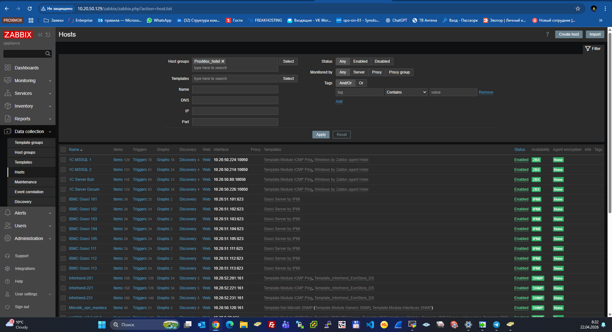
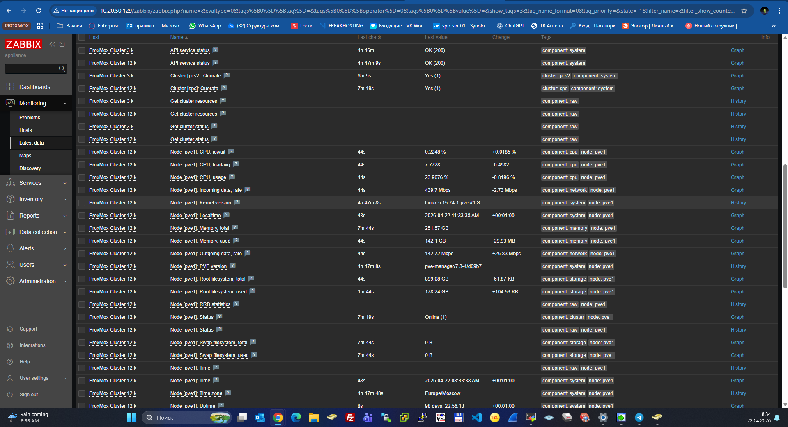
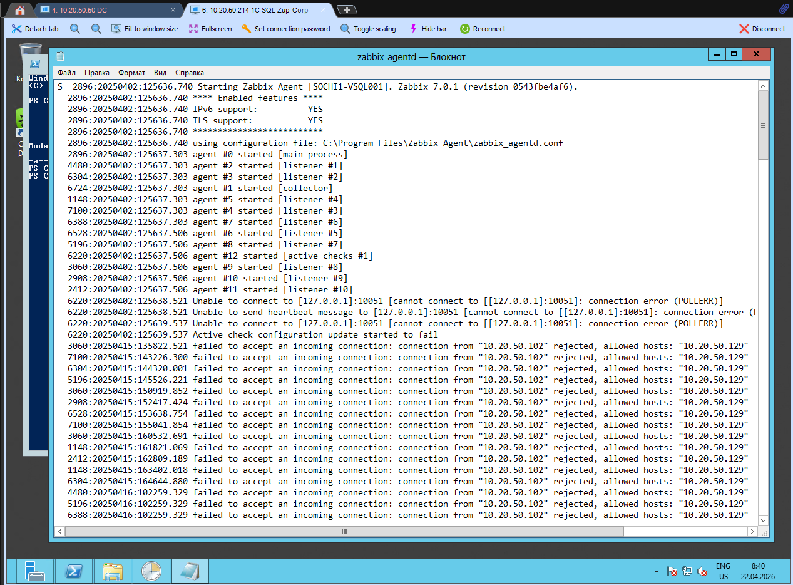

# Домашнее задание к занятию «Система мониторинга Zabbix»

## ФИО: Скоробогатов Евгений Сергеевич

---

## Задание 1. Установка Zabbix Server с веб-интерфейсом

### Использованные команды

```bash
apt update && apt upgrade -y
apt install -y postgresql

wget https://repo.zabbix.com/zabbix/6.0/debian/pool/main/z/zabbix-release/zabbix-release_6.0-4+debian11_all.deb
dpkg -i zabbix-release_6.0-4+debian11_all.deb
apt update

apt install -y zabbix-server-pgsql zabbix-frontend-php php7.4-pgsql zabbix-apache-conf zabbix-sql-scripts zabbix-agent

sudo -u postgres psql
create user zabbix with password 'password';
create database zabbix owner zabbix;
\q

zcat /usr/share/zabbix-sql-scripts/postgresql/server.sql.gz | sudo -u postgres psql -d zabbix

systemctl restart zabbix-server zabbix-agent apache2
systemctl enable zabbix-server zabbix-agent apache2
### Скриншот веб-интерфейса Zabbix


Задание 2. Установка Zabbix Agent на два хоста

В рабочей инфраструктуре уже был развернут сервер Zabbix.
Для выполнения задания были подключены два хоста с установленными Zabbix Agent.

Установка агента (Windows)

Один из агентов установлен на Windows-хосте.

Скачан Zabbix Agent с официального сайта
Распакован в каталог:
C:\Program Files\Zabbix Agent\
Отредактирован файл конфигурации:
zabbix_agentd.conf

Основные параметры:

Server=10.20.50.129
ServerActive=10.20.50.129
Hostname=1C SQL Zup-Corp
Установлен и запущен сервис Zabbix Agent:
zabbix_agentd.exe --install
zabbix_agentd.exe --start
Проверка работы агента:
Get-Service -Name "Zabbix Agent"

Статус: Running

### Скриншот Configuration → Hosts




### Скриншот Monitoring → Latest data




### Скриншот лога Zabbix Agent


